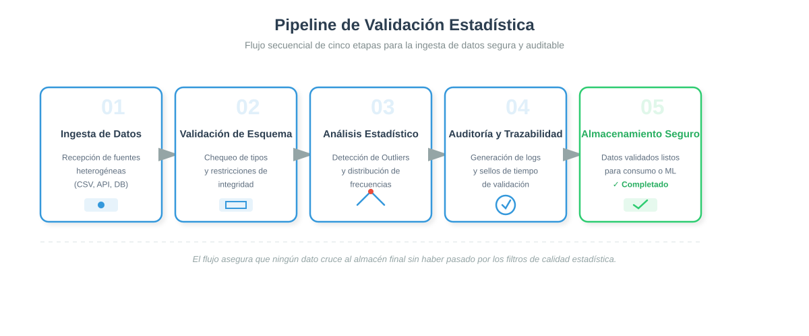
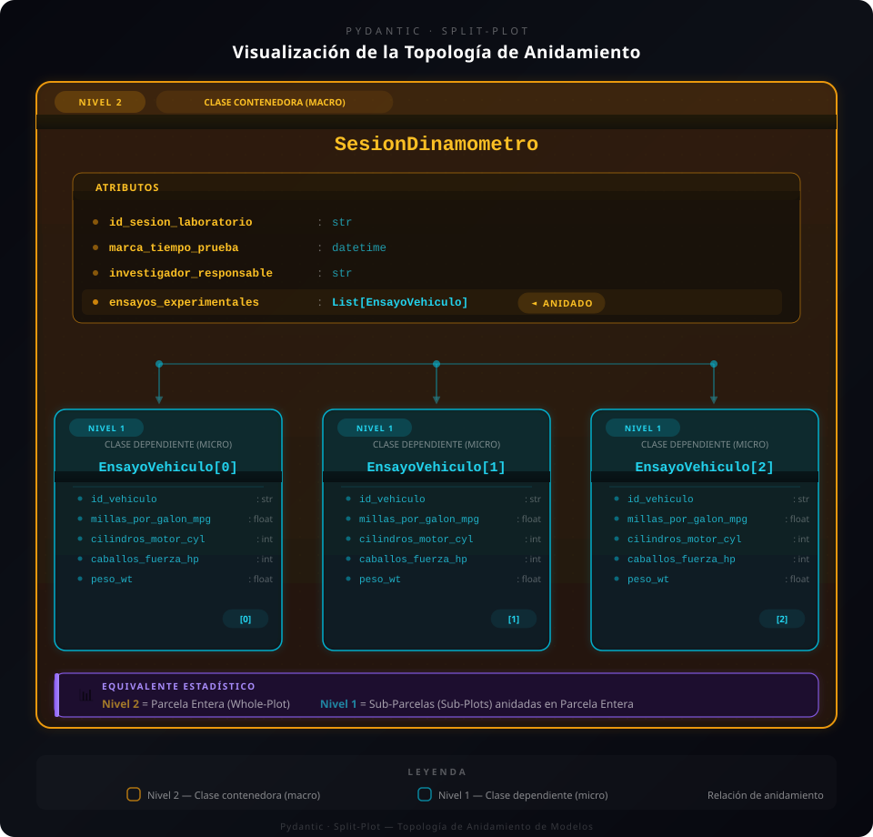

<!--
  Semana 7 · Validación avanzada de datos.
  Cubre los 60 min de exposición del reparto («Antes de empezar»): introducción 5,
  tipos 13, validadores 19, anidados 23 y error 422 10 (el material mide 70).
  La práctica guiada de 180 min se presenta al final, no se desarrolla.
  Código verificado con Python 3.11, FastAPI 0.141 y Pydantic 2.13
  (taller_corte2/build/venv).
-->

# Por qué validar antes de modelar {seccion=modulo-0}

> Con una edad de −5, su regresión no protesta: calcula. Devuelve coeficientes, *p*-valor e intervalo, con la misma cara de seguridad que si los datos fueran buenos.

???
5 minutos para toda la sección. Es la motivación del material, casi literal: dejarla caer y preguntar quién ha visto un modelo ajustado sobre datos que nadie revisó.

## Un modelo no sabe que le mintieron {.idea etiqueta="El problema de la semana"}

Un fallo ruidoso se ve. Una edad de −5 que entra se convierte en una conclusión que usted tendrá que defender en la sustentación **sin saber que está podrida**.

???
Es el lema del capítulo. La semana 4 enseñó a declarar que un campo es `int`; esta semana, a decir *qué* entero, con qué rango, dentro de qué estructura, y a explicar por qué se rechazó.

## En producción nadie mira los datos: las reglas se escriben antes

{alto=430}

La etapa 2 es la **aduana**: tipos, rangos y campos obligatorios, antes de cualquier cálculo.

???
En el análisis exploratorio hay un analista mirando y decidiendo sobre la marcha; en un pipeline automático, no. Por eso el paradigma es confirmatorio: la decisión sobre un dato raro se codifica de antemano. Es la primera pregunta del cuestionario de la sección 2.

# El tipo es el libro de códigos {seccion=modulo-1}

> Declarar un tipo es escribir el *codebook* de la encuesta antes de salir a campo.

???
13 minutos. La analogía del material: el codebook dice qué significa cada columna y qué valores admite; el tipo lo vuelve una regla que se cumple, no un comentario.

## `int` ya no alcanza: una edad y un número de encuesta son los dos enteros

| Anotación | Qué declara | En estadística |
|---|---|---|
| `List[float]` | Vector homogéneo | Una columna de la matriz de diseño |
| `Optional[T]` · `T \| None` | Valor o faltante explícito | La no respuesta, documentada |
| `Literal["a", "b"]` | Niveles cerrados | Un factor con niveles conocidos |
| `Annotated[int, Field(ge=0, le=120)]` | Tipo **y** rango | Un criterio de inclusión |

Y solo una de las dos puede valer 40 000.

???
La tabla 1.1.2 del material trae `List`, `Union`, `Optional` y `NDArray`; aquí van las que usan los ejemplos de la semana. `NDArray[np.float64]` queda para la lectura: sirve a mypy, no a Pydantic.

## Tipo y rango van en la misma línea

```python ObservacionClinica {resaltar=2,4,5}
class ObservacionClinica(BaseModel):
    edad: Annotated[int, Field(ge=0, le=120, description="Edad en años")]

    presion_sistolica: Annotated[float, Field(ge=60.0, le=250.0)]
    tratamiento: Literal["placebo", "dosis_baja", "dosis_alta"]
```

`ge` y `le` son el rango; `Literal`, los niveles del factor. Lo que queda fuera no entra.

???
Es la solución del ejercicio 2 de la sección 3 (1.5), sin la `description` de la presión. Preguntar qué pasa con `tratamiento="dosis_media"`: 422, porque no está entre los niveles.

## `Optional` obliga a decidir qué hacer con el faltante {columnas=3:2}

```python EspecificacionCoche
modelo_vehiculo: Optional[str] = Field(
    default=None,
    description="Identificador nominal del sujeto experimental"
)
```

|||

- `Optional[T]` es `T | None`: el faltante es un valor **legal**
- No se disfraza de 0 ni de `NaN`
- Imputar o excluir pasa a ser una decisión **explícita**

???
Un `None` convertido en cero sesga la media y la varianza sin que nadie lo note. El material lo formaliza como unión disjunta (ecuación 1.1); en clase basta con la consecuencia.

## ¿Su API acepta `"25"` en un campo `edad: int`? {.pregunta tipo=E2}

Un cliente envía `{"edad": "25"}`, con la edad **entre comillas**.

::: respuesta Sí, en el modo por defecto
Pydantic trabaja en modo **laxo**: convierte `"25"` en `25` y responde 200. Con `model_config = ConfigDict(strict=True)` el mismo JSON da 422, `int_type`.
:::

???
Es la pregunta 1 de sustentación (sección 9). Comprobado: modo laxo, 200; estricto, 422. La tabla 2.1.2 del material compara los dos modos.

# Validadores: el criterio de exclusión {seccion=modulo-2}

> Una saturación de oxígeno de 104 % viola el dominio fisiológico igual que una edad negativa. El validador es la regla que la rechaza.

???
19 minutos, la sección más cargada de la exposición.

## Un validador es un criterio de exclusión del protocolo, en código

```python ObservacionIris {resaltar=1,5-6}
@field_validator('especie_taxonomica')
@classmethod
def validar_factor_categorico(cls, valor: str) -> str:
    valor_limpio = valor.strip().lower()
    if valor_limpio not in cls.ESPECIES_PERMITIDAS:
        raise ValueError(
            f"Anomalía Taxonómica. Especie no reconocida: '{valor}'. "
            f"El hiperespacio poblacional permite: {cls.ESPECIES_PERMITIDAS}"
        )
    return valor_limpio
```

`raise ValueError` **rechaza**; `return` deja pasar el valor, aquí ya normalizado.

???
Del ejemplo del dataset iris (sección 4, 2.3). Un nivel fantasma como «rosa» crearía grados de libertad espurios en un ANOVA. Notar que el validador también normaliza (`strip().lower()`): valida y transforma a la vez, como pregunta la sustentación 5.

## Limpiar el formato: `before`. Comprobar la regla: `after`.

::: flujo
1. **Dato crudo** — str, int, dict… sin validar
2. **mode='before'** — `"1,234.56"` → `"1234.56"`, `"NA"` → `None`
3. **Coerción** — `"4"` → `4`, o `ValidationError`
4. **mode='after'** — rango y dominio, sobre el tipo ya seguro
5. **Valor validado** — listo para el análisis
:::

???
Es el diagrama 2.2 del material, «Arquitectura del pipeline de validación por campo», que proyectado no se lee: aquí va como flujo. La pregunta que sigue muestra qué pasa si se confunden.

## El rango 1–6 en `mode='before'`, y llega `"3"` {.pregunta tipo=E2}

Su validador de **estrato socioeconómico** comprueba que el valor esté entre 1 y 6. Lo declaró con `mode='before'`, y el JSON trae el estrato como el string `"3"`.

¿Qué responde la API?

::: respuesta Ni 200 ni 422: un error del servidor
En `before` el valor todavía es `"3"`, y `1 <= "3"` lanza **`TypeError`**. Pydantic no lo convierte en error de validación: sale como 500. La regla de rango va en `after`, cuando ya es `int`.
:::

???
Pregunta 4 de sustentación. Comprobado con Pydantic 2.13: el `TypeError` sube tal cual. Buena ocasión para decir que un validador solo produce 422 si lanza `ValueError` o `AssertionError`.

## ¿Qué está mal en este validador? {.pregunta tipo=E3}

```python
@field_validator('edad')
@classmethod
def validar_edad(cls, v: int) -> int:
    if v < 0:
        return abs(v)
    return v
```

::: respuesta Corrige en silencio
Convierte −25 en 25 y **esconde** el fallo del instrumento. Lo correcto es rechazar: `raise ValueError(f"Edad con valor negativo detectado: {v}. ...")`.
:::

???
Ejercicio 2 de la sección 4 (2.4), sin los comentarios que delatan la respuesta. El material llama a esto «mutación silenciosa». La alternativa de apartar el dato para revisarlo (*dead letter queue*) está en el mismo ejercicio.

## Del ejemplo iris salen 3 rechazos de 15: una tasa del 20 %

| Índice | Valor | Validador | Por qué |
|---|---|---|---|
| 3 | `sepal_length = -5.1` | `auditar_axiomas_biologicos` | Una longitud no es negativa |
| 7 | `petal_length = 85.0` | `auditar_axiomas_biologicos` | Probable error de mm a cm |
| 11 | `especie = "rosa"` | `validar_factor_categorico` | Nivel fuera del factor |

Por encima del 5 % de exclusión, hay que **investigar el mecanismo**.

???
La tasa del 20 % es deliberada, para el ejercicio. El decorador `@cronometrar_bootstrap` del mismo ejemplo mide cuánto cuesta validar; queda para la lectura.

## Cada rechazo es un dato faltante que usted fabricó {.idea icono=fa-scale-balanced}

Si los rechazos caen en los extremos reales —los centenarios legítimos que una regla `le=120` expulsa—, el mecanismo es **MNAR** y la muestra que queda está sesgada.

???
Es el cierre del pliegue sobre la taxonomía de Rubin (sección 4): rechazos estructurales tienden a ser MCAR; rechazos que se concentran en valores extremos, MNAR. Por eso la bitácora de exclusiones no es burocracia.

# Modelos anidados: la forma del diseño {seccion=modulo-3}

> Si su dato tiene bloques y unidades, su modelo también debería tenerlos.

???
23 minutos, la sección más larga. Si el tiempo aprieta, el material dice que es la que mejor aguanta quedar como lectura: en ese caso, dar solo las tres primeras diapositivas y la pregunta.

## Un modelo anidado tiene la forma de una parcela dividida {columnas=5:4}

{alto=470}

|||

- **Contenedor** — `SesionDinamometro`: el bloque, la parcela entera
- **`List[...]`** — la agrupación de unidades dentro del bloque
- **Anidado** — `EnsayoVehiculo`: la unidad observacional

Misma forma, distinto contexto.

???
Es el diagrama 3.2 del material. «Isomorfo» asusta en el texto; en voz alta es «tienen la misma forma», como dos organigramas con los mismos niveles.

## Aplanar la jerarquía en una tabla pierde la correlación intraclase

- La tabla rectangular **repite** el contexto del bloque en cada fila
- Las observaciones de un mismo bloque no son independientes
- Tratarlas como si lo fueran infla el tamaño de muestra efectivo

$$ \text{ICC} = \frac{\sigma^2_{\text{entre}}}{\sigma^2_{\text{entre}} + \sigma^2_{\text{dentro}}} $$

???
Ecuación 3.2 del material. Es el argumento estadístico del anidamiento: pseudorreplicación. El caso de COVID en regiones del NHS (Dhada y Labra Montes, 2024) queda para la lectura.

## Una sola línea anida el nivel micro dentro del macro

```python {resaltar=11}
# 1. NIVEL MICRO: Sub-modelo dependiente (Unidad observacional)
class EnsayoVehiculo(BaseModel):
    id_vehiculo: str = Field(min_length=2)
    cilindros_motor_cyl: int
    peso_wt: float = Field(..., gt=0.0, le=10.0)

# 2. NIVEL MACRO: Modelo Principal Contenedor (Bloque experimental)
class SesionDinamometro(BaseModel):
    id_sesion_laboratorio: str = Field(pattern=r'^SES-\d{4}-[A-Z]{2}$')
    investigador_responsable: str = Field(min_length=3)
    ensayos_experimentales: List[EnsayoVehiculo]
```

Cada nivel lleva sus reglas: el patrón del bloque, el rango de cada unidad.

???
Recortado de la sección 5 (3.3): sin las `description`, sin `millas_por_galon_mpg` ni `caballos_fuerza_hp`, que repiten el patrón de `peso_wt`. Validar la sesión con `model_validate` valida también cada vehículo, en cascada.

## El bloque exige su tamaño de muestra

```python SesionDinamometro {resaltar=6}
@field_validator('ensayos_experimentales')
@classmethod
def validar_potencia_muestral_del_bloque(
    cls, ensayos_vector: List[EnsayoVehiculo]
) -> List[EnsayoVehiculo]:
    if len(ensayos_vector) < 3:
        raise ValueError(
            f"Insuficiencia de Grados de Libertad: El diseño estadístico "
            f"exige al menos 3 vehículos por sesión. Recibidos: {len(ensayos_vector)}"
        )
    return ensayos_vector
```

La sesión `SES-2024-CC`, con 2 vehículos, se rechaza **entera**.

???
Con menos de 3 unidades no se estima la varianza intrabloque. Es un validador del nivel macro que mira la colección, no a cada unidad.

## El tercer vehículo trae 5 cilindros {.pregunta tipo=E2}

Una sesión con tres ensayos; el tercero tiene `cilindros_motor_cyl = 5` (solo se admiten 4, 6 y 8).

¿Se rechaza solo ese vehículo o la sesión completa? ¿Qué dice el error?

::: respuesta La sesión completa, y el error dice dónde
```text
('ensayos_experimentales', 2, 'cilindros_motor_cyl')  value_error
```
Si una unidad del bloque está corrupta, todo el bloque queda bajo sospecha.
:::

???
Ejercicio 1 de la sección 5 (3.5); el material usa el décimo vehículo, aquí el tercero. Comprobado: la ruta del error incluye el índice. El ejercicio pide además la alternativa que aparta solo el vehículo inválido: buen puente con la práctica.

## Cuando la regla cruza campos, va en `model_validator`

```python AdmisionDiaria {resaltar=1,3}
@model_validator(mode='after')
def validar_coherencia_admisiones(self):
    if self.admisiones_uci > self.admisiones_nuevas:
        raise ValueError(
            f"Incoherencia lógica: admisiones UCI ({self.admisiones_uci}) "
            f"no puede superar admisiones totales ({self.admisiones_nuevas})"
        )
    return self
```

Un `field_validator` ve un campo; `model_validator` ve el registro entero.

???
Del caso epidemiológico de la sección 5 (3.4): UCI es un subconjunto de las admisiones. Mismo patrón que la pregunta avanzada de la sección 4: `fecha_alta >= fecha_ingreso` en un estudio de supervivencia.

# El rechazo que explica su motivo {seccion=modulo-4}

> Si sus validadores solo saben decir «no», su API es tan difícil de usar como un formulario que se pone rojo sin decir dónde.

???
10 minutos. La frase es de la motivación del capítulo.

## 422: el JSON llegó bien; el dato no cumple el dominio {columnas=1:1}

- **422** — sintaxis correcta, contenido fuera de las reglas: edad = 200
- **409** — petición válida que **choca** con lo que ya hay: el sujeto ya fue registrado

La respuesta dice qué campo, qué regla y por qué.

|||

```text Respuesta de FastAPI a edad = 200
HTTP 422 Unprocessable Entity

{"detail": [{
  "type": "less_than_equal",
  "loc": ["body", "edad"],
  "msg": "Input should be less than or equal to 120",
  "input": 200
}]}
```

???
Respuesta real de FastAPI 0.141. OJO: la tabla 4.1.2 del material dice que un JSON mal formado (sin comilla de cierre) da 400; en FastAPI da 422 con `type: json_invalid`. Por eso aquí no se proyecta la fila del 400: ver la nota de entrega.

## `loc`, `type` y `msg`: dónde, qué regla y por qué

```python {resaltar=5,7,9}
try:
    sujeto = ObservacionDemografica.model_validate(registro)
    sujetos_validados.append(sujeto)
except ValidationError as error_auditoria:
    errores = error_auditoria.errors()
    for fallo in errores:
        campo = ' -> '.join(str(x) for x in fallo['loc'])
        print(f"   Campo: {campo}")
        print(f"   Tipo:  {fallo['type']}")
#>    Campo: edad_biologica
#>    Tipo:  greater_than_equal
```

???
De `procesar_lote_muestral` (sección 6, 4.3), recortado: sin el bucle externo ni el `print` del mensaje. La salida es la del sujeto 1002, edad −15, comprobada. El sujeto 1005, «preescolar», da `literal_error`.

## ¿Qué pierde este código? {.pregunta tipo=E3}

```python
def procesar_datos(lista_datos):
    resultados = []
    for dato in lista_datos:
        try:
            resultado = Modelo.model_validate(dato)
            resultados.append(resultado)
        except Exception:
            pass
    return resultados
```

::: respuesta Todo rastro de lo que excluyó
`except Exception: pass` se traga los rechazos: no queda qué se excluyó ni por qué, no hay diagrama STROBE posible y los que sobreviven sesgan el análisis. Capture `ValidationError` y registre cada exclusión.
:::

???
Ejercicio 2 de la sección 6 (4.4). Además atrapa errores que no son de validación: un fallo del propio código también desaparecería.

## La bitácora de exclusiones es su diagrama STROBE

::: tarjetas {columnas=3}
### Registrar
Momento, sujeto, campo, tipo de error, mensaje y valor rechazado
### Reportar
El flujo de participantes que piden CONSORT y STROBE
### Diagnosticar
Fallas del instrumento y el mecanismo de pérdida: MCAR, MAR, MNAR
:::

???
Es la clase `BitacoraAuditoria` de la sección 6: el ejemplo completo está en el material. Sin registro de exclusiones, reportar el flujo de un estudio es imposible.

# Cierre y práctica {seccion=modulo-6}

## Lo que se llevan hoy {.cierre}

- El tipo es el libro de códigos: `Annotated`, `Literal` y `Optional` dicen **qué** valor entra
- Limpiar el formato en `before`; comprobar la regla en `after`
- Rechazar, no corregir en silencio, y registrar por qué
- Un modelo anidado tiene la forma del diseño; un error adentro rechaza el bloque
- El 422 explica: `loc`, `type` y `msg`

???
Recordar que el capítulo es el más largo del curso: el material dice qué es de clase y qué de consulta, en «Antes de empezar».

## Práctica guiada: la API de encuestas poblacionales

::: flujo
1. **Modelos** — `Encuestado`, `RespuestaEncuesta` y `EncuestaCompleta`, anidados
2. **Validadores** — edad, estrato 1–6, departamento, Likert; uno `before` y otro `after`
3. **Endpoints** — CRUD más `/encuestas/estadisticas/`
4. **Errores** — un manejador de 422 que explique cada campo
:::

::: info Sustentación
Puede usar IA, pero debe explicar cada línea. Las 15 preguntas de la sección 9 son las de la sustentación.
:::

???
Los 180 minutos de práctica. El enunciado completo, con requerimientos técnicos (venv, Git, estructura, Swagger) y rúbrica, está en la sección 8 del material: proyectarlo desde ahí.
